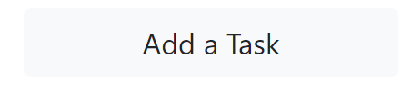
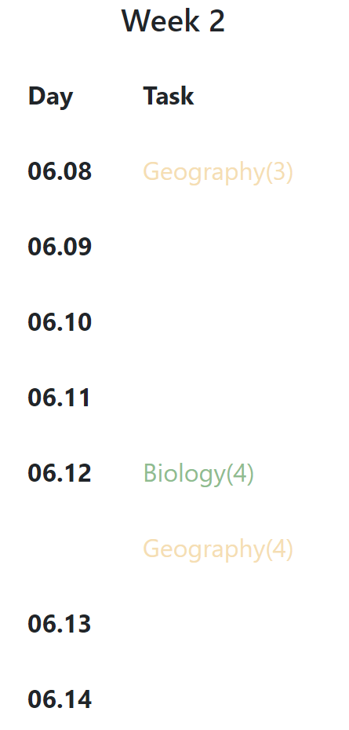
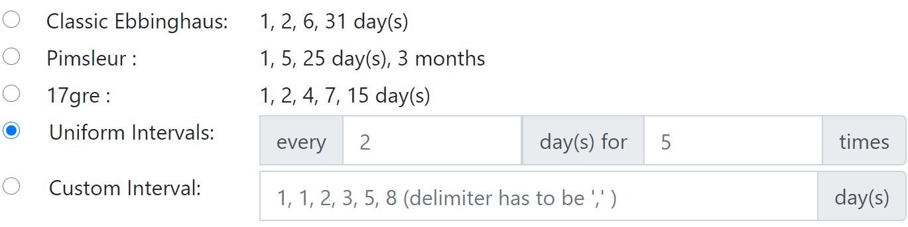
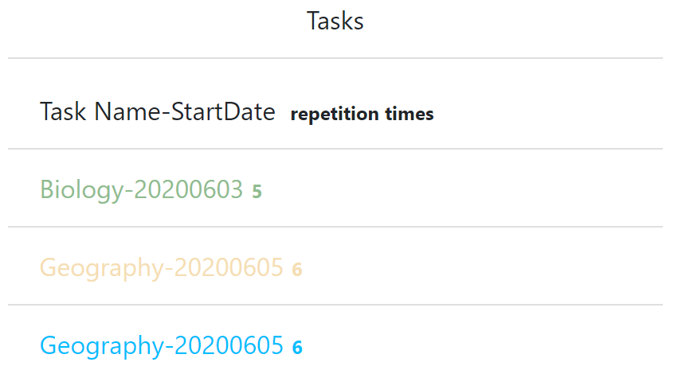

# Spaced_Repetition2.ics
Set your custom intervals and export a **spaced repetitions** calendar in ics format

online: https://tsaihsing3.github.io/Spaced_Repetition2.ics/


## Background

### What is Spaced Repetition

Hermann Ebbinghaus indentified [Spacing Effect](https://en.wikipedia.org/wiki/Spacing_effect) and published his well-known [Forgetting Curve](https://en.wikipedia.org/wiki/Forgetting_curve) in 1885. Numerous further studies together with **learning techniques** and tools based on this effect —— [Spaced repetition](https://en.wikipedia.org/wiki/Spaced_repetition) —— have thrived ever since.

According to Spaced Repetition Method, learners shall repeatly **relearn** the learning material after certain time intervals.
( [Actival Recall Principle](https://en.wikipedia.org/wiki/Active_recall) is often adviced for effectiv re-learning)


### Intervals
Both expanding and uniform interval could be adopted in Spaced Repetition.
1. Hermann Ebbinghaus tested ***20 minutes,1 hour, 9 hours, 1 day, 2 days, 6 days and 31 days***  intervals in his work;
2. Paul Pimsleur set intervals as ***5 seconds, 25 seconds, 2 minutes, 10 minutes, 1 hour, 5 hours, 1 day, 5 days, 25 days, 4 months, and 2 years***;
3. Interval pattern ***12 hours, 1 day, 2 days, 4 days, 7 days, 15 days*** is introduced for GRE vocabulary **recognition** by Yang Peng in his best-selling *Nailing GRE Words in 17 Day* ;

Those 3 interval patterns are already preset so you can choose them via a radio section yet repetitions within a day or longer than a year is neglected.
Besides **custom** 4. uniform intervals or 5. expanding (even shrinking) intervals are also allowed.


### Features

A standard canlendar file (.ics)  would be generated and exported via this lightweight tool.


If you need only custom **uniform** intervals, a much easier way is to directly create **recurring events** in your calendar service. Offical instruction links for recurring event in some popluar calenar services are as follows:

 * Google Calendar :  [Create a recurring event](https://support.google.com/calendar/answer/37115?co=GENIE.Platform%3DDesktop&hl=en)
 * Outlook : [Schedule repeating appointments as recurring events in Outlook](https://docs.microsoft.com/en-us/graph/outlook-schedule-recurring-events)
 * Apple Calendar :[Add an event to a calendar on iCloud.com](https://support.apple.com/en-za/guide/icloud-ipad/mmfbbb32be/icloud)

If you are looking for learning more than 100 words each day *intensively*, tools developed based on *GRE Words in 17 Day*  Method(**17GRE**) are recommended. 17GRE Method allows you to set a series of tasks (so called "lists") that start sequentialy.

Also, Spaced Repetition software programs as **Anki**, **SuperMemo**, etc dynamicsly set subsequent intervals based on recall tests' **performance**. However tests and performance results are not considered in this tool.


This tool is featured to set **custom non-uniform intervals**. 

For example, to learn 4 times within 10 days,‘1,3,5', '2,3,3','1,5,2' (days) or any interval pattern you like can be processed. 


A 'day' as the unit, all repetitions ( relearning ) would be created as a all-day event( `VEVENT` item in [iCalendar Format Standard](https://tools.ietf.org/html/rfc7986)), task' name and repetition's time count in the event's 'summary' ( `SUMMARY` Property). All events are wrapped in a calendar called 'Spaced Repetition'( `VCALENDAR` item) to be downloaded as a file named 'Spaced_Repetition.ics'


## Usage

1. Add a Task
   - Enter a Task Name.
   - Choose a Task Colour:
      - A Colour   is selected evertime the page been loaded. 
      - A new random color can be generated by  .
   - Set Intervals:
     - Choose from Ebbinghaus pattern, Pimselur pattern, 17gre pattern or input you own intervals.
     - Spaces are allowed but only comma( ',' ) is accepted as the delimiter.
   - Input a Start Date:
     - In `YYYYMMDD` format.
   - Click   to add this task.
2. Preview in Tasks List
   
   - Each coloured list item include a task's **name**, **start date** and **repetition times**( learning + re-learning ). 
3. Preview in a 5-week Calendar
   - Weeks start on a Monday, which is in the same week with the Calendar's start date. 
   - Repetitions in the range of display would be listed on the right to their date.
   
   - **repetitions out of the range exist and are included in the exported ics file**. If need, change the calendar's display range to see them. 
   - Modify the calendar's Start Date and click  button to change the calendar's display range .
4. Export .ics file
   - Click  button to export. 
5. Import to Any Calendar Service You Like.
   - Although `COLOR` Property is defined and can be used on a `VEVENT` item since *rfc7986(2016)* , colours are always used to distinguish *different calendars*  in commen calendar services. Therefore **usually events' colours are not displayed.** 

## Code Explanation
### Overall Introduction
  This tool is based on Javascript. Scripts are placed at the `<head>` part of the page. Data is processed by users' browsers at the front-end. Bootstrap is used for decoration. 
  
### Initialization

1. A `tasks` Array is created to store `task` objects in the future
2. A `tasksContent` Array is created to store content required for a .ics file needs.
3. When the window is loaded, call three functions as Initialization.
```JavaScript
//the new task is given a random CSS3 Standard colour 
setEventColor();

//set task's and calendar's default start date as today
setStartDate();

//find the monday when this first week begins 
//delete ,if any, all displayed dates and list all new 7 * 5 = 35 dates 
updateCal();
```

At the end of `updateCal()` function, an `addCalEvent()` function is called to process `tasks` Array's items. `tasks` being void so far, this call has no effect.

####  Why a CSS3 Standard Colours, not Any Hex Colour?
Only names of CSS3 standard colours are supported in iCalendar standard as value of the `COLOR` Property for event VEVENT.


### Add a Task
  A ` addTask()` function is called when  button is clicked.
  1. A `task ` object is created. Data would be stored as its attributes.
  2. To begin with, its `name`, `color` , `startDate` attributes are attained through `document.getElementById()`.
 ```JavaScript
let taskName = document.getElementById("inputTaskName").value;
let taskColor = document.getElementById("inputTaskColor").innerHTML;
//get startDate
let startDateString = document.getElementById("inputStartDate").value;
var startDate1 = new Date();
startDate1.setFullYear(startDateString.slice(0,4), startDateString.slice(4,6) - 1, startDateString.slice(6,8));
 ```
 
 
   3. For the `intervals` attribute, radios are iterated. `id` of the checked radio reveals the interval pattern selected and, if custom interval pattern, other necessary parameter(s).
       
       
```JavaScript
let radios = document.getElementsByName("selectInterval");
var intervalArray = new Array();
for (var i = 0; i < radios.length; i++)
{
  if(radios[i].checked == true)
   {
     let inputInterval = radios[i];
     if a programmed interval mode
     if (["Ebbinghaus","Pimsleur","17gre"].indexOf(radios[i].id) > -1 ){
       ...
     }
     else if ( radios[i].id == "UniformIntervalsRadio"){
       ...
     }
     else if (radios[i].id == "CustomIntervalsRadio" ){
       ...
     }
   }
}
```
 
  4. Via methods of `Date` Objects in JavaScript, dates for relearning is calculated. Dates for learning(Start Date) and for relearning are then stored in `task["repetitions"]`.
  5. The `task` object is pushed to a Array named `tasks` for later use. 
 ```JavaScript
tasks.push(task);
 ```
  6. `setEventColor()` is called again to generate a new random colour for the next task.
  
 
### Display Previews
Afterwards task's information is displayed in two preview sections.

#### Preview in a Tasks List

The Task List section is a Bootstrap `card` component.
```html
<div class="card col-4"   style="width: 18rem;" >
  <div class="card-header bg-transparent text-center mb-2" >Tasks</div>
  <div>
    <ul class="list-group mb-3 list-group-flush" id="tasksList">
      <li class="list-group-item">Task Name-StartDate 
        <span class="badge">repetition times</span> 
       </li>
    </ul>
  </div>
  ...
</div>
```
To update this `card`, `addTask()` calls a `addTaskList()` function, passing the `task` object as a parameter.
 ```JavaScript
addTaskList(task); 
 ```
 `addTask()` function do as follows:
 1. find the `<ul>` element whose `id` =`"tasksList"`.
 2. create s new `<li>` element that includes name, start date, repetition times of the task.
 
HTML code required:
```html
<li class="list-group-item">Task Name-StartDate<span class="badge">repetition times </span> </li>
```
JavaScript code:
```JavaScript
let taskListItem = document.createElement("li");
taskListItem.innerHTML = task["name"] +"-" +formatDate(task["startDate"]);

var classNode = document.createAttribute("class");
classNode.value = "list-group-item";
taskListItem.setAttributeNode(classNode);

// add a badge display 
var spanNode = document.createElement("span");
var classNode = document.createAttribute("class");
classNode.value = "badge";

spanNode.innerHTML = (task.repetitions.length ).toString();
spanNode.setAttributeNode(classNode);
```
 4. Insert the `<li>` element as child of the `<ul>` element.

### Preview in a Calendar
 This calendar is a Bootstrap `card-group` component, in which there is 5 `card` components. Each components represents a week. All 35 days' date has been inserted in **Initialization** step and marked with `id`.

```html
<tbody id="week1body">
  <tr>
    <th scope="row" id="20200601th">06.01</th>
    <td id="20200601td" style="color: purple;">Biology(1)</td>
  </tr>
  <tr>
    <th scope="row" id="20200602th">06.02</th>
  </tr>
  ...
</tbody>
```

To update these `card`s, `addTask()` calls a `addCalEvent()` function, passing a `task` object as a parameter
 ```JavaScript
addCalEvent(task);
 ```
 `addCalEvent()` function do as follows:
  1. Iterate `<td>` element for whose `id` indicates that the day of the repetition is shown on the calendar, i.e. this repetition date is (1)inside the range of calendar preview and (2) there is/are already repetition(s) on the same day. 
  2. if the `<td>` element is found:
     -  Generate a `<tr>` element with a void `<th>` child element and a `<td>` child element that contains this repetition's information.
     -  Insert this new `<tr>` element after the parent `<tr>` element of the found `<td>` element. 
  4. if the `<td>` element is not found yet a `<th>` element represent the same day is found, i.e. the day this repetition date is inside the range but this day has no repetition yet.
     - Generate a `<td>` element that contains this repetition's information
     - Insert this new `<td>` element after the found `<th>` element.

The `<td>` element, if inserted, should look like this:
```html
<td id="20200601td" style="color: purple;">Biology(3)</td>
```
#### Modify the Calendar's Display Range

 Modify the Calendar's Start Date and click  button.
 A `updateCal()` function is called. It would :
 ```html
<table class="table table-borderless week-table" >
  <thead>
    <tr>
      <th scope="col">Day</th>
      <th scope="col">Task</th>
    </tr>
  </thead>
  <tbody id="week1body">
    <!-- Old Dates Elements Begin Here -->
    <tr>
      <th scope="row" id="20200601th">06.01</th>
      <td id="20200601td" style="color: purple;">Biology(1)</td>
    </tr>
    ...
    <!-- Old Dates Elements End Here -->
   </tbody>
 </table>
 ```


 1. Delete displayed dates and other items by removing everthing inside the `<tbody>` tags.
```JavaScript
weekDates = new Array();
var weekbody = document.getElementById("week"+(i+1)+"body");
// remove all children elements
weekbody.innerHTML = ""
```
2. New 7 * 5 = 35 dates are displayed by inserting new `<tr>` and `<th>` tags.
3. An `addCalEvent()` function is called to process `tasks`. Repetitions inside the range are displayed. 
 
### Generate a File
To generate a `addTask()`,
1. Call `taskEventsString()` function which iterates dates in all `task["repetitions]`, create a string for a `VEVNET` item in iCalendar format.
```JavaScript
    function taskEventsString(task)
    {
        let eventsArray = new Array();
        for (var i = 0; i < task["repetitions"].length; i++)
        {
            let eventArray = new Array();
            eventArray.push(VEVENT_BEGIN_STRING);
            eventArray.push("DTSTART;VALUE=DATE:" + formatDate(task["repetitions"][i]));
            eventArray.push("DTEND;VALUE=DATE:" + formatDate(task["repetitions"][i]));

            eventArray.push("DTSTAMP:" + formatDate(task["repetitions"][i])+ "T000000Z");
            
            eventArray.push("UID:" + createUUID());
            eventArray.push("COLOR:"+ task["color"]);
            eventArray.push("SUMMARY:" + task["name"] +"(" + (i + 1).toString() + ")");
            eventArray.push(VEVENT_END_STRING);
            eventArray.push("\n");

            let eventString = eventArray.join("\n");
            eventsArray.push(eventString);
        }
        eventsArray.push("\n");
        let eventsString = eventsArray.join("\n");
        return eventsString;
    }
``` 
4. Push the string to `tasksContent` Array.
```JavaScript
// add events to second to last place, aka, insert before VCAL_END_STRING
tasksContent.splice((tasksContent.length - 1), 0, taskEventsString(task)); 

```
5.Update URL of File based on the updated `tasksContent` Array.
```JavaScript
updateFile(tasksContent,"Spaced_Repetition.ics");
```
Here `updateFile()` function uses a HTML5 feature. A `Blob` Object is created based on `tasksContent` Array and a new URL for the `Blob` Object is created and set as the  button's `href`.
```JavaScript
    function updateFile(contentArray,filename)
    {
        let txtBlob = new Blob(contentArray,{type:"text/calendar"});
        let txtURL = URL.createObjectURL(txtBlob);
        let exportBth = document.getElementById("ExportBtn");
        exportBth.setAttribute("download", filename);
        exportBth.setAttribute("href", txtURL );
    }
```
Effect:
```html
<a class="btn btn-link" href="txtURLExample" role="button" id="ExportBtn" download="Spaced_Repetition.ics">Export to iCalendar File (.ics)</a>
```
### Export .ics File
The  button is essentially a link `<a>` disguised as a button.  Download begins as it is clicked.


